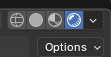

# BlenderBackground
How to create a 3D background on Blender and import to Android Studio. You will learn how to dowbload 3D models and how to apply textures from 
## Table of Contents

## Installation

Download the newest Blender Release Candidate onto system:
[https://builder.blender.org/download/daily/](https://builder.blender.org/download/daily/)

Download the .zip file of the 3D Model:
[https://drive.google.com/file/d/1DyBhBpiQDfC5jdB3CQ9LoL4jLg8_2ZAN/view?usp=sharing](https://drive.google.com/file/d/1DyBhBpiQDfC5jdB3CQ9LoL4jLg8_2ZAN/view?usp=sharing)

  - Note: Once you download and unzip the file, make sure you open it and unzip all three internal files

## Importing Model on Blender

1. Open Blender and Create a new General file
  
2. On the top right delete all scene objects
  - Note: On keyboard, press 'a' to select all objects, then press 'x' to delete them

3. On the top left click on 'File' then goto 'Import' and click on 'FBX' to import from your files

4. Locate Sci-fi white interior 3D model file and open file to locate the '1000 Museum fbx' file and import

## Rendering Textures onto 3D Model

1. On the top right, click on the circle farthest to the right to render the model\

  - Note: It is the circle highlighted in blue
2. Enable Node Wrangler to automatically format textures
  - Note: On the top left goto 'Edit' --> 'Preferences' --> 'Add ons' --> type 'Node Wrangler' and check it off
